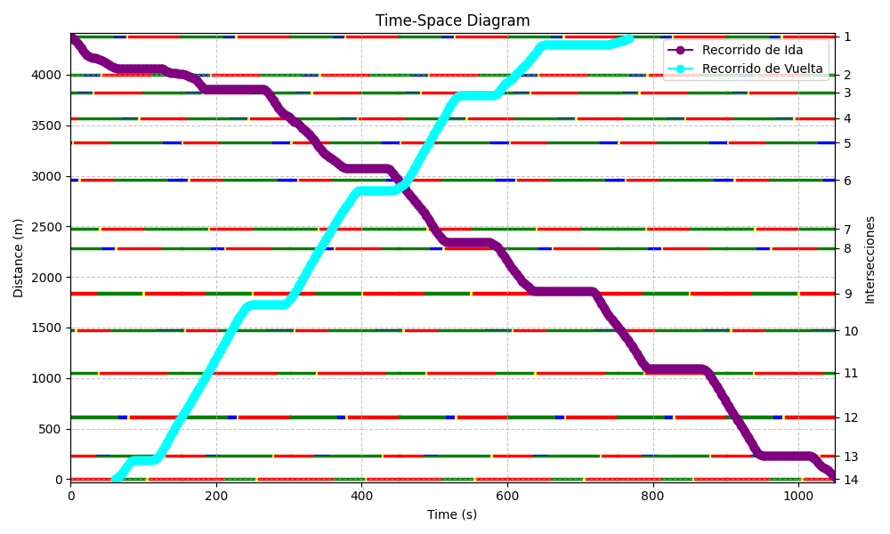
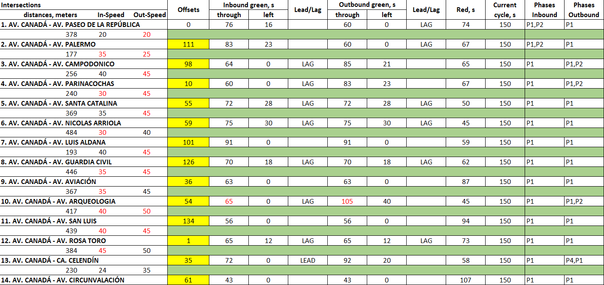
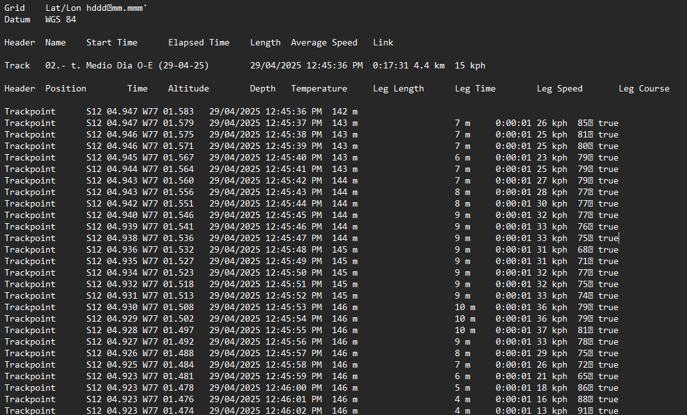
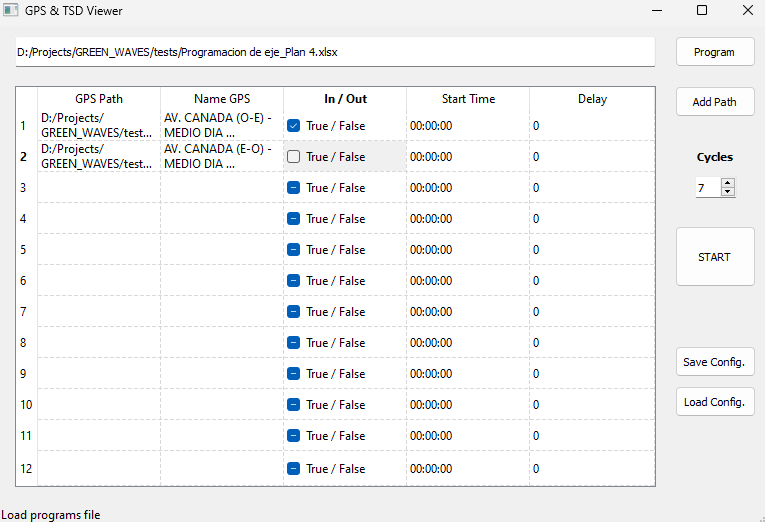

# GPS & TSD Viewer

Aplicación de escritorio (PyQt5) para visualizar recorridos GPS sobre un diagrama Tiempo–Espacio y superponer la programación semafórica (ola verde) por sentido.

---

## ✨ Características

- Carga de archivo de **programación** (Excel `.xlsx`).
- Carga de **rutas GPS** (uno o más `.txt`) y asignación de sentido (ida/vuelta).
- Parámetros por archivo: **hora de inicio**, **desplazamiento (delay)** y **número de ciclos** a graficar.
- **Diagrama Tiempo–Espacio** con:
  - Bandas de semáforo por intersección y sentido.
  - Trayectorias de cada recorrido GPS (ida: morado, vuelta: cian).
- Guardado rápido de **configuración** en `config.txt`.

---

## 🧱 Estructura del proyecto
├── main.py # Ventana principal, señales y flujo de la app

├── utils.py # Parsing de Excel, parsing de GPS, plotting

└── interface.py # Código generado de PyQt5 (.ui → .py)


---

## 🔧 Requisitos

- Python 3.10+ (recomendado)
- Paquetes:
  - PyQt5  
  - pandas  
  - numpy  
  - matplotlib  
  - openpyxl  
  - icecream (opcional para debug)

Instalación rápida:

```bash
python -m venv .venv
# Windows
.venv\Scripts\activate
# Linux/Mac
source .venv/bin/activate

pip install -r requirements.txt
```

---


## ▶️ Ejecución
```bash
python main.py
```

Se abrirá la ventana GPS & TSD Viewer.

---

## 🖥️ Guía rápida de uso (GUI)

### 1) Cargar programación (Excel)

- Haz clic en Program y selecciona tu archivo .xlsx.
- La ruta aparece en la caja superior. Estado: “Load programs file”.

### 2) Agregar archivos GPS

- Clic en Add Path y selecciona uno o varios .txt.
- Se autocompleta:
    - GPS Path (ruta absoluta),
    - Name GPS (nombre de archivo).

### 3) Completar parámetros por fila

- En la tabla (12 filas por defecto) cada recorrido GPS debe tener:
    - In / Out: marca la casilla si es Inbound (ida). Déjala desmarcada si es Outbound (vuelta).
    - Start Time: hora HH:MM:SS desde la cual se filtra y alinea el GPS.
    - Delay: desplazamiento (segundos) para alinear curvas/recorridos.

### 4) Definir número de ciclos

- Selector Cycles (por defecto: 3). Controla la ventana temporal del diagrama.

### 5) Iniciar

- Clic en START:
    1. Se arma un DataFrame con la tabla.
    2. Se lee la programación (read_program).
    3. Por cada fila válida se procesa el .txt con gps_tracking(...).
    4. Se genera el diagrama con draw_tracking(...).



## 🧪 Formato de entradas

1. Las programaciones semafóricas son por eje o ruta el cual recorre del vehículo que cuenta con datos de GPS.



2. Los datos de GPS (tracking) utilizan el formato .txt de Garmin. En caso sea de un estilo o marca distinto, se debe modificar el código adaptándose a la estructura de datos.



3. La interfaz presenta botones fáciles de entender para ingresar los inputs mencionados. Se coloca un ejemplo de los datos que se encuentran en /tests.


---

## 💾 Guardar configuración
- Save Config. crea un config.txt (CSV) con cabeceras:

    ```["GPS Path", "Name GPS", "In / Out", "Start Time", "Delay", "Cycles"]```

    y una fila por cada entrada no vacía.

- La app muestra el path en la barra de estado.

- **Load Config. aún no está implementado.**

---

## ⚠️ Errores comunes y tips

- **Excel no válido / hoja vacía:** se mostrará un QErrorMessage.
- **Formato de hora:** usa estrictamente HH:MM:SS en Start Time.
- **Sentido (In/Out):** marca Checked para Inbound; deja vacío para Outbound.
- **Delay y offsets:** Delay desplaza un recorrido individual; los offsets vienen del Excel.
- **Ciclos:** si no ves toda la trayectoria, incrementa Cycles.